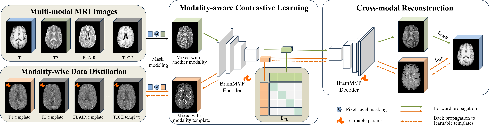
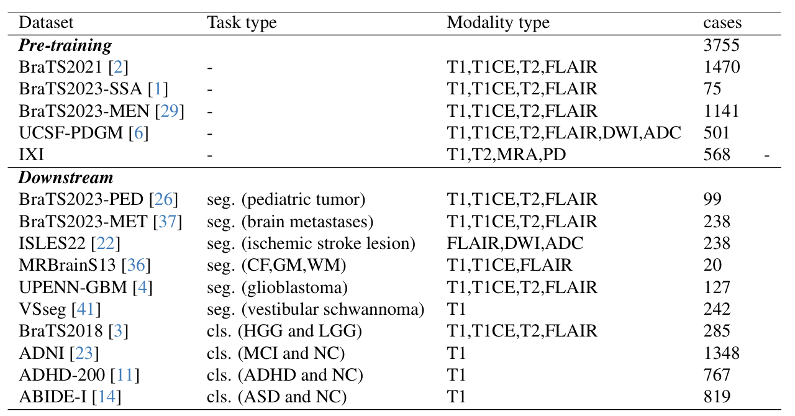

# BrainMVP 
<a href="https://arxiv.org/abs/2410.10604"></a>
<a href='https://huggingface.co/datasets/shaohao011/BrainMVP-16k'></a>

Code for our CVPR 2025 paper [Multi-modal Vision Pre-training for Medical Image Analysis](https://arxiv.org/abs/2410.10604)

[openmedlab](https://github.com/openmedlab/BrainMVP)
TL;DR

This work introduces BrainMVP, the first pre-training framework designed for large-scale missing modality medical imaging. We have made available the pre-training 16k mpMRI images and corresponding pretrained models.

We achieve state-of-the-art performance on 10 open-source segmentation and classification tasks. Feel free to use it to adapt to your own tasks!


## Abstract
Self-supervised learning has greatly facilitated medical image analysis by suppressing the training data requirement for real-world applications. Current paradigms predominantly rely on self-supervision within uni-modal image data, thereby neglecting the inter-modal correlations essential for effective learning of cross-modal image representations. This limitation is particularly significant for naturally grouped multi-modal data, e.g., multi-parametric MRI scans for a patient undergoing various functional imaging protocols in the same study. To bridge this gap, we conduct a novel multi-modal image pre-training with three proxy tasks to facilitate the learning of cross-modality representations and correlations using multi-modal brain MRI scans (over 2.4 million images in 16,022 scans of 3,755 patients), i.e., cross-modal image reconstruction, modality-aware contrastive learning, and modality template distillation. To demonstrate the generalizability of our pre-trained model, we conduct extensive experiments on various benchmarks with ten downstream tasks. The superior performance of our method is reported in comparison to state-of-the-art pre-training methods, with Dice Score improvement of 0.28\%-14.47\% across six segmentation benchmarks and a consistent accuracy boost of 0.65\%-18.07\% in four individual image classification tasks.


## Datasets

### Pre-training
You can download our 16k mpMRI pre-training data on your own or download from our [huggingface repo](https://huggingface.co/datasets/shaohao011/BrainMVP-16k).
### Downstream
All downstream datasets are open-source. If you encounter any difficulties downloading them, please feel free to email ruishaohao@sjtu.edu.cn to request access.

## Get Started

**Installation**
```bash
conda create -n brainmvp python=3.9
conda activate brainmvp
pip install -r requirements.txt
```

**Download Model**

We prepare two varients of our pre-trained models [Uniformer (recommend)](https://drive.google.com/file/d/1DTmz5WACESD0wfkZ2r0x-zjTwOgd9ov3/view?usp=drive_link) and [Unet](https://drive.google.com/file/d/16DvqjYBfenNEdggLu2fXuMJ6FjxBxQsS/view?usp=drive_link).


**Pre-train**
```bash 
CUDA_VISIBLE_DEVICES=0,1,2,3 bash do_pretrain.sh
```
**Finetune**

We provide example code for fine-tuning on the BraTS-PED dataset, which you can modify to suit your own task.
```bash 
# train
cd Downstream
bash do_train.sh
# test
bash do_test.sh
```

## 🙏 Acknowledgement

A lot of code is modified from [MONAI](https://github.com/Project-MONAI/MONAI).

## 📝 Citation

If you find this repository useful, please consider citing this paper:
```
@article{rui2024brainmvp,
  title={BrainMVP: Multi-modal Vision Pre-training for Brain Image Analysis using Multi-parametric MRI},
  author={Rui, Shaohao and Chen, Lingzhi and Tang, Zhenyu and Wang, Lilong and Liu, Mianxin and Zhang, Shaoting and Wang, Xiaosong},
  journal={arXiv preprint arXiv:2410.10604},
  year={2024}
}
```

